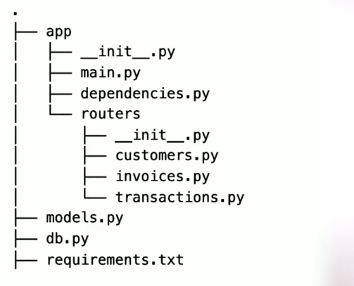

# FastAPI


## Instalación  
```
pip install -r requirements.txt
```
Ejecutar la aplicación en modo desarrollo.
```
fastapi dev
```


## Estructura de la aplicación


## Diagrama de BD


## Midlewares
Permiten agregar funcionalidades a todos los requests y response de nuestra API


## Template de la comunidad 

La comunidad de FastAPI ha creado un template listo para su uso. Puedes encontrarlo en el siguiente [enlace](https://github.com/fastapi/full-stack-fastapi-template)
```
https://github.com/fastapi/full-stack-fastapi-template
```

## Reporte de pruebas unitarias
```
coverage run --source app/ -m pytest
coverage report
```
